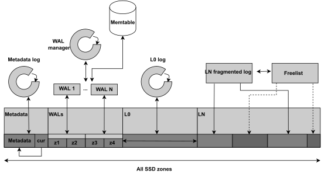
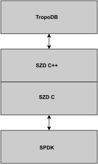

# TropoDB

TropoDB is a key-value store built directly on raw SSD storage. TropoDB was made to investigate the potential of having full control over SSD storage and what benefits such a design could bring.
To get full control it makes use of (and only allows):

* NVMe ZNS SSDs, reducing the need of a Flash Translation Layer (FTL) with a Garbage Collector (GC).
* [SZD](https://github.com/Krien/SimpleZNSDevice): a simple API built on top of SPDKs ZNS functionalities, removing the kernel mostly from the storage path. In other words, the database lives entirely in user-space!
* No file system at all. To get full control, the store is built directly on storage.

## ZNS key-value store design

TropoDB uses an LSM-tree design similar to many other key-value stores as it naturally fits SSDs. However, the way the LSM-tree is persisted to storage is unique. Unique to TropoDB is its approach to design the individual LSM-tree components and how it divides the available storage. TropoDB claims an entire part of the SSD, runs the database in user-space and does not allow for multi-tenancy. Claiming an entire region, allows it to designate areas for each LSM-tree component. Rather than building components on generic files and hoping the file system does proper hot and cold separation, each component lives in a designated region and has a specialistic storage design. We have a specialistic:

* WAL design
* L0 design
* L1..LN design
* Metadata design

The design as a whole looks like the following: .

For more information on how these components work, we refer to the paper in the `./paper` directory.
There the design is explained component by component, including how they interact.

## Implementation

TropoDB is not an entirely new key-value store. It continues on the key-value stores [LevelDB](https://github.com/google/leveldb) and [RocksDB](https://github.com/facebook/rocksdb). In particular the API, benchmark tooling (db_bench) and memtable implementation are reused from RocksDB. Most of the key-value store logic originated from LevelDB, with some slight modifications to allow for an approach without a file system abstraction, but a SZD abstraction instead. This results in the following lean stack:


## Project layout

TropoDB is a master thesis project and under heavy development. Breaking changes can and will happen. No guarantees can be made on stability (and many parts are known to not work). Do not use in production code!
The project exists out of two subprojects, both are available in `implementation`, but only one is functional. These are `db` and `rocksdb`. `db` was an alteration of the LevelDB API, which was dropped. `rocksdb` is an alteration of RocksDB. This alteration only supports CMake as the original Makefile is disabled/removed. Changes are maintained in:

* `implementation/rocksdb/db_impl_switcher/*`: allows switching between conventional RocksDB and TropoDB.
* `implementation/rocksdb/db/tropodb/*`: all of the logic of TropoDB.
* `implementation/rocksdb/znsdevice/*`: Legacy SZD implementation (now moved to separate repo)
* `implementation/rocksdb/znstests/*`: test applications, tests (stale/need updates...), benchmarking scripts

## How to install

```bash
git submodule update --init --recursive # Retrieve SZD, SPDK and DPDK
cd  implementation/rocksdb
pushd .
cd third-party/SimpleZNSDevice/dependencies/spdk
# Follow SPDK install instructions and built SPDK
popd
# Follow RocksDB install instructions for the tool you need
```

## How to use

The project can be used similarly to RocksDB, also for benchmarking. It requires a few changes.
The device must first be attached to SPDK:

```bash
export PCI_ALLOWED=${PCI_ADDR} # PCIe_ADDR of device to use
implementation/rocksdb/third-party/SimpleZNSDevice/dependencies/spdk/scripts/setup.sh
```

Then on usage, we need to specify a TRID, not a path.
For db_bench do:

```bash
# add these two options
db_bench --use_zns --db=<TRID> # with TRID the  PCIe address
```

From C++ code do:

```C++
// We only showcase what is different for TropoDB, the rest is the same as for RocksDB.
rocksdb::Options opts; // The RocksDB options for opening a database.
opts.use_zns_impl = true;
// Set a ZNS uri, this is different from a file system uri and looks like:
//  zns://<TRID> with TRID the PCIe_Address
```

## License

The licenses are taken as they are from RocksDB. Those are quote:
"RocksDB is dual-licensed under both the GPLv2 (found in the COPYING file in the root directory) and Apache 2.0 License (found in the LICENSE.Apache file in the root directory). You may select, at your option, one of the above-listed licenses."
